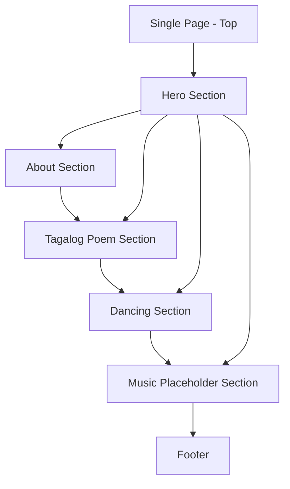

## 1. Product Overview
A cute, pink, animated single-page website celebrating Nicole Missiona.
It presents a short Tagalog poem, a “dancing” interactive section, and a background-music UI placeholder suitable for deployment on GitHub + Vercel.

## 2. Core Features

### 2.1 User Roles
Not required (public, single-page, read-only site).

### 2.2 Feature Module
Our single-page website consists of the following main page:
1. **Single Page (Nicole Missiona)**: top navigation (anchor links), hero intro, about section, Tagalog poem section, dancing interactive section, background music placeholder, footer.

### 2.3 Page Details
| Page Name | Module Name | Feature description |
|-----------|-------------|---------------------|
| Single Page (Nicole Missiona) | Site shell | Render a single route page with smooth scrolling between sections; keep all content client-side and static-build friendly. |
| Single Page (Nicole Missiona) | Top navigation | Jump to sections via anchor links (Hero / About / Poem / Dance / Music); highlight active section on scroll (basic). |
| Single Page (Nicole Missiona) | Hero (cute intro) | Show name “Nicole Missiona” with pink animated decorations (sparkles/hearts), short subtitle, and primary CTA to scroll to the poem or dance section. |
| Single Page (Nicole Missiona) | About section | Display a short friendly description card about Nicole (editable text content). |
| Single Page (Nicole Missiona) | Tagalog poem | Present a short Tagalog poem block with stylized typography; include a “Copy poem” button. |
| Single Page (Nicole Missiona) | Dancing section | Provide an animated character/shape (CSS/SVG) and a “Dance” toggle button; animate while enabled (loop). |
| Single Page (Nicole Missiona) | Background music placeholder | Show music controls (Play/Pause, volume slider, track label) wired to a placeholder audio source; clearly indicate “Add your own .mp3 file” if no audio is provided. |
| Single Page (Nicole Missiona) | Footer | Show simple credits and links (GitHub repo, Vercel deployment URL placeholder). |

## 3. Core Process
**Visitor Flow**
1. Open the website and see the hero intro.
2. Use the top navigation (or scroll) to read About and the Tagalog poem.
3. Go to the Dance section and toggle dancing on/off.
4. Optionally interact with the Music placeholder controls (may show “No track loaded” until an audio file is added).
5. Reach the footer and access external links.

**Content: Tagalog Poem (initial draft, editable)**
> Sa rosas na himig ng umagang kay lambing,
> Nicole Missiona, ikaw ang munting ningning;
> Sa bawat ngiti, may kislap na pag-asa,
> Parang bituing sayaw sa kalangitang masaya