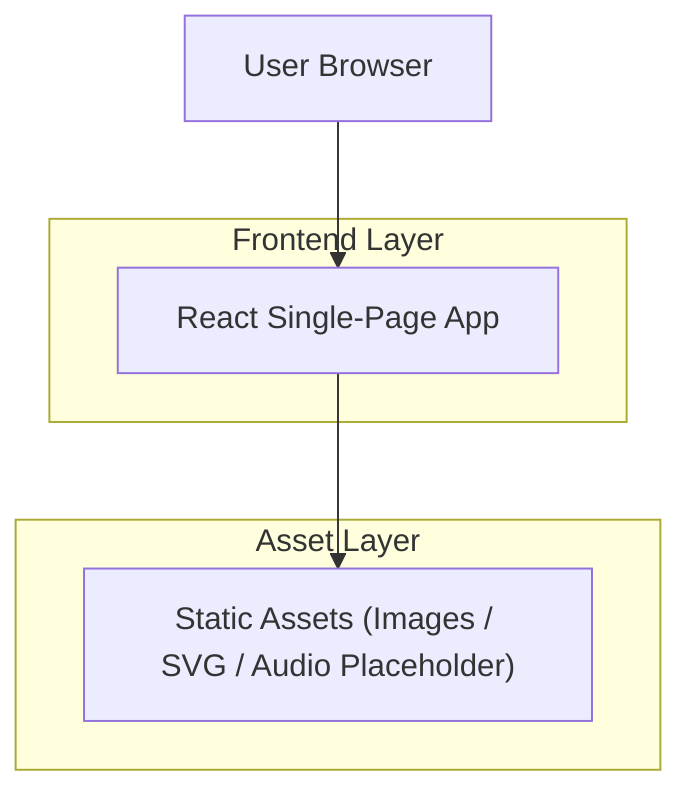

## 1.Architecture design

## 2.Technology Description
- Frontend: React@18 + vite + tailwindcss@3
- Animation: CSS keyframes (default) + optional framer-motion (if needed)
- Backend: None (static site)

## 3.Route definitions
| Route | Purpose |
|-------|---------|
| / | Single-page experience containing Hero, About, Poem, Dance, Music Placeholder, Footer |
